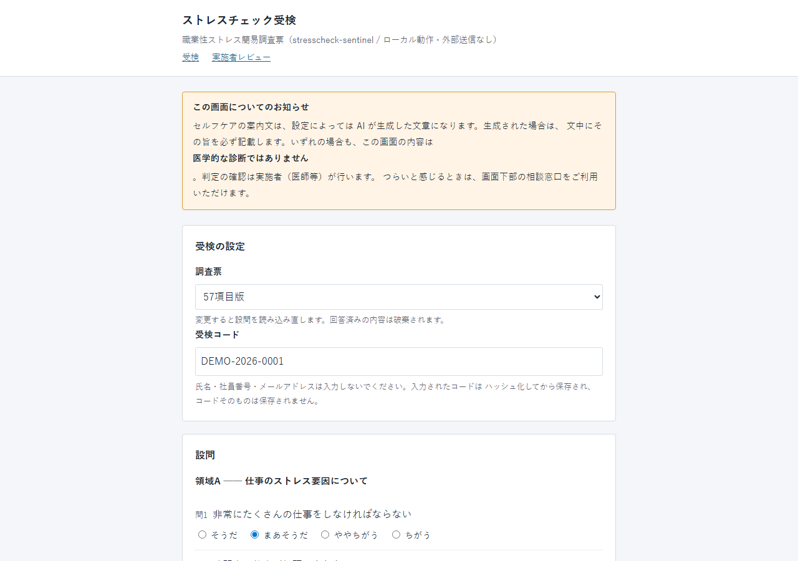
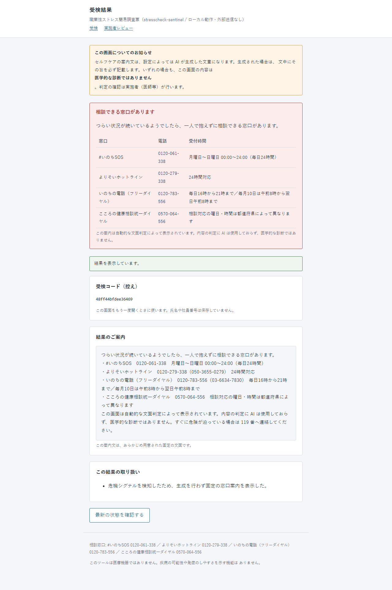
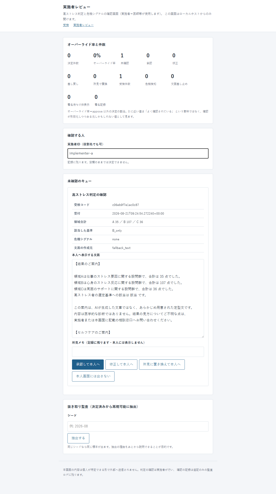
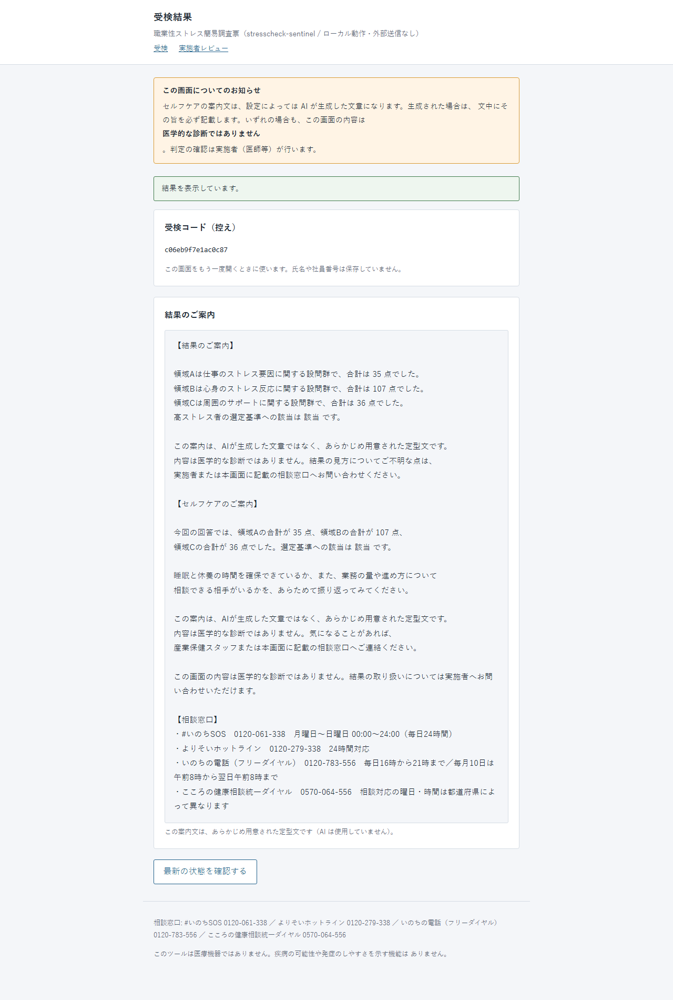

# stresscheck-sentinel

法定ストレスチェック (職業性ストレス簡易調査票) の**決定論的な採点コア**と、
その上に載せた **AI ガバナンス層** — 境界ゲート・人間レビュー (HITL)・評価 (Evals)。

面白いのは採点ではない。採点は算術で、基準は公開されている。
面白いのはその上の層 — **LLM に何を触らせないか、誰が署名するまで結果を下流に流さないか、
プロンプトを変えた後も安全な振る舞いが保たれていることをどう示すか**である。

- ランタイム依存 **0**。`git clone` してそのまま動く。
- 外向きの通信は、生成を明示的に有効にした時の `http://localhost:11434` (Ollama) **だけ**。
- 課金要素ゼロ・アカウント不要・API キー不要。
- 既定では LLM を呼ばない (`NullProvider`)。モデルが無くても全機能が動く。

**技術スタック**: Python 3.12 (標準ライブラリのみ — `sqlite3` / `http.server` / `csv` / `hashlib` / `urllib`) /
開発時のみ pytest + ruff / 評価時のみ promptfoo (npm、`npx` 実行) / LLM は任意で Ollama (ローカル)。

**誰向けか**: ストレスチェックの実施事務を担う立場 (人事・衛生管理者・産業保健スタッフ) と、
その結果を確認する実施者 (医師等) の 2 者を想定している。受検者はブラウザで回答するだけで、
アカウントも個人情報の登録も要らない (受検はハッシュ化トークンで識別する)。

**既存の選択肢との違い**: 厚生労働省が無償配布している実施プログラム (Ver.4.0) は Windows 専用・
ソース非公開・3 年の利用期限付きで、判定の中身を読むことも、事業場ごとに基準を差し替えることもできない。
本リポジトリは公開マニュアルから独立実装し、**判定基準を CSV として読める形に置いた**うえで、
その上に AI を使う場合の境界を足している。

---

## なぜこの題材か

**心理社会的な労働環境は、いま国際的に「測って手を打つ」対象になっている。**
ILO が 2026 年 4 月に出した報告書の要旨は、心理社会的リスク要因によって
年間 **84 万人**が死亡し、年 **4,500 万 DALYs** が失われ、その損失は
**世界 GDP の 1.37%/年**に相当するとしている。週 48 時間超の労働は 35%、
職場での暴力・ハラスメントの経験は 23% (うち心理的暴力 18%)。
同報告書はデジタル化と **AI が仕事の調整・監視・評価のしかたを変えつつある**ことも名指ししている。

日本ではこの領域に法定の仕組みが既にある。そして 2 つの期日が迫っている。

| 期日 | 何が変わるか |
|---|---|
| **2027-04-01** | 集団分析について、個人が識別できない方法によることを求める改正の施行 |
| **2028-04-01** | 労働者 **50 人未満**の事業場にもストレスチェックが**義務化** (令和 7 年法律第 33 号) |

現状の実施率は、50 人以上が 89.8%、30〜49 人が 58.4%、10〜29 人が 55.9%
(令和 7 年 労働安全衛生調査)。つまり **2028 年に義務の対象になる層は、まだ半分弱が未実施**である。

その層に「AI で自動化しました」を持ち込むと、真っ先に壊れるのは
**医師 (実施者) にしか委ねられない判断**と、**プログラム医療機器 (SaMD) の線**である。
このリポジトリは、その線を注意書きではなく**機械的に守れる形**で書いたらどうなるか、を実装したもの。

---

## どう作ったか

3 層あり、**層の境界そのものが製品**である。

以下の画面はすべて `python -m sentinel.cli serve` を実際に起動して撮ったもので、
写っている受検コード・実施者 ID・自由記述は架空の値である
(受検コードは保存前にハッシュ化されるため、画面に出ているのはハッシュの先頭 16 桁)。



受検者の入口。**開示は生成文が出た時だけでなく常設**である
(生成しなかった回にだけ開示が消えると、開示の有無そのものが手がかりになってしまう)。
氏名・社員番号は「入力しないでください」と書いてあるのではなく、入力欄が存在しない。

### 1. 決定論コア — LLM ゼロ・ネットワークゼロ・乱数ゼロ

純関数。逆転項目・領域合計・高ストレスの切り分けは `data/` の CSV にあり、コードに埋め込まれていない。
公開されている切り分け値は**あくまで例示**で、事業場が実施者の意見と衛生委員会を経て変更できる —
だから閾値ファイルの差し替えだけで変えられる。

**未回答があれば判定しない** (補完しない)。埋めた値で人の扱いが変わることを避けるため
(→ [ADR-0004](docs/adr/ADR-0004-missing-answers-withhold-the-verdict.md))。

### 2. 境界ゲート — 順序固定の 3 本

```
crisis  →  samd_lint  →  signature
```

| ゲート | 何を止めるか |
|---|---|
| **crisis** | 自由記述の危機シグナルを**決定論の段階判定木** (探索 → 意図 → 計画 → 準備) で検知し、**生成を迂回**して固定の相談窓口を返す。安全判定を LLM に委ねない |
| **samd_lint** | 疾病名・罹患可能性・リスク% 表示など、診断側に倒れる表現を block。**免責文言は代わりにならない** (→ [ADR-0007](docs/adr/ADR-0007-non-medical-device-by-function-not-disclaimer.md)) |
| **signature** | 実施者 (医師等) の署名レコードが無い限り、結果は本人へ流れない |

**辞書が空なら起動しない。** 禁止語 0 件・危機タクソノミ 0 件のまま「ゲートが有効なつもり」で
動く状態を、起動時の例外で潰してある。



`crisis` ゲートが発火した回。自由記述に希死念慮の表現があったため、**プロンプトは組み立てられず
provider は一度も呼ばれない**。窓口の文面は `data/hotlines_ja.csv` の転記で、生成物ではない。
**本人には窓口案内をその場で表示する** — 署名や生成を待たせない。それとは別に、危機が検知された事実は
実施者のキューに `crisis_review` として載り、実施者があとから把握できる (本人への窓口表示は止めない)。

### 3. LLM 任意層 — ローカルのみ・既定は生成なし

用途はセルフケア文面の下書きと平易な言い換えだけ。採点・判定・危機対応には使わない。
プロンプトは `prompts/prompts.yaml` に外出しして版管理し、必須トークン
(相談窓口・AI である旨の開示・診断ではない旨) の存在を**ユニットテストで強制**する。

### 人間レビュー (HITL) — 決定型は 4 つ

```
PENDING ──approve──▶ SIGNED           署名レコード生成 → 下流解禁
        ──edit─────▶ SIGNED(edited)   差分を監査ログへ
        ──reject───▶ REJECTED         再試行抑止
        ──respond──▶ SIGNED(manual)   AI 出力を使わず実施者の所見をそのまま採用
```

`approve`/`reject` の 2 択にしなかったのは、実施者が現実にやるのが
「直して出す」と「AI の文章は使わず自分で書く」だからである。この 2 つを潰すと、
実施者は**画面の外で仕事をする** = 記録に残らない経路ができる。

中断 id は `sha256(受検token + 段階名)` の先頭 16 桁で、同じ受検の同じ段階なら常に同じ id になる
(再開時の二重登録・二重実行が構造的に起きない)。監査ログは hash 連鎖の追記専用。
`sentinel kpi` は**オーバーライド率** (人間が AI 出力を採らなかった割合) を出す。



実施者のキュー。**レビュー対象は点数ではなく、本人がこれから読む文面そのもの**である
(点数だけ見せられた人に `edit` と `approve` を選び分けさせることはできず、`respond` に至っては
置き換える対象が存在しない)。実施者 ID が空欄のままではどのボタンも決定にならない。

### 評価 (Evals) — 3 層、安全は決定論が持つ

| 層 | 対象 | 判定者 | CI |
|---|---|---|---|
| 1 | 採点境界値ゴールドセット 47 件 | 決定論 | 毎 push |
| 1' | 敵対的入力 35 件 (診断要求 / リスク% 要求 / 危機表現 / 指示の上書き) | 決定論ゲートが**先に落とすこと**を assert | 毎 push |
| 2 | セルフケア文面 10 シナリオ | LLM-judge **2 本** + 決定論 lint | ローカル |
| 3 | 危機応答の質 (VERA-MH 日本語版・非対称スコア) | rubric | ローカル |

ゴールドセットの期待値は**実装の出力を採録したものではない**。厚生労働省の判定基準文から
書き起こした述語で生成し (生成スクリプトは製品コードを import しない)、
実行時にはさらに**品目 CSV と閾値 CSV だけを読む別実装**で合計点を計算し直す。
ゴールドセット・別実装・製品の 3 者が一致したときだけ緑になる。

---

## 実測

すべて 2026-08-21 の実行結果。詳細は
[`docs/evidence/EVALS_RUN_2026-08-21.md`](docs/evidence/EVALS_RUN_2026-08-21.md)、
生の出力は [`docs/evidence/promptfoo_run_2026-08-21.json`](docs/evidence/promptfoo_run_2026-08-21.json)。



同じ受検を実施者が `approve` した直後の本人画面。**署名レコードが書かれるまで、この本文は
`release()` から返らない** (それまでは状態も文面も「実施者が確認しています」に置き換わる)。
既定の `NullProvider` で撮っているため文面は定型文で、その旨が本人にも表示されている。

| 検査 | コマンド | 結果 |
|---|---|---|
| ユニット/統合テスト | `python -m pytest -q` | **591 passed, 1 skipped** |
| 決定論 Evals (CI で回る側) | `python evals/run_deterministic.py` | **107/107 passed** (exit 0) |
| lint | `ruff check .` / `ruff format --check .` | All checks passed / 52 files formatted |
| promptfoo (層1・1'・2) | `npx promptfoo eval -c evals/promptfooconfig.yaml` | **88/92 passed・errors 0**・所要 11分02秒・**外部送信ゼロ** |
| └ 層1・1' (モデル不要) | | **82/82** |
| └ 層2 (Ollama 生成 + judge 2 本) | | 6/10 |
| 生成文の SaMD lint | `assert_output_lint.py` | **10/10 通過** |

この skip は意図的なもの (下記 Limitations 参照)。

### judge の一致度 — そして、一致率を信じてはいけない理由

```
基準             n     一致率   kappa   alpha  不一致
---------------------------------------------
共感            10  1.000   -     -
具体性           10  0.600  0.000 -0.188  SC-01, SC-03, SC-05, SC-06
窓口案内          10  1.000   -     -
非診断           10  1.000   -     -
ALL           40  0.900  0.000 -0.039
```

**一致率 0.900 を「よく一致した」と読むのは間違いである。**
judge 1 は 40 件すべてを pass にしており、片方に分散が無いため偶然一致補正 (κ / α) はほぼ 0 か負になる。
このデータは同時に「**judge 1 が何でも通す傾向を持つ**」ことも示している。

これは失敗ではなく、この設計が予期していた事象がそのまま観測されたものである。
だから安全性の可否は judge ではなく決定論ゲートに置いてある
(→ [ADR-0006](docs/adr/ADR-0006-safety-evaluation-deterministic-first.md))。

落ちた 4 件はすべて `具体性(judge2)` で、内容は「**窓口に相談する**を具体的な行動と数えるか」で割れている。
モデルの不具合ではなく、判定基準の書き方がまだ判定者に委ねている部分である。

---

## Quickstart

**インストールは要らない。** ランタイム依存がゼロなので、clone してパスを通すだけで動く。

```bash
git clone https://github.com/leagames0221-sys/stresscheck-sentinel.git
cd stresscheck-sentinel

# macOS / Linux
export PYTHONPATH=src
# Windows PowerShell:  $env:PYTHONPATH = "src"

python -m sentinel.cli --version          # sentinel 0.1.0
python -m sentinel.cli serve              # http://127.0.0.1:8765 (loopback のみ)
```

`serve` は 3 画面を出す — 受検フォーム (`/`)、結果 (`/result`)、実施者レビュー (`/review`)。
Content-Security-Policy は `default-src 'self'`。外部フォントも CDN も無く、オフラインで完結する。

### CLI で 1 分

```bash
# 採点 (純関数。判定に LLM もネットワークも関与しない)
#   --answers は {項目番号: 1..4} の JSON。ここでは 23 項目すべてに 2 を入れている
python -m sentinel.cli score --variant 23 \
  --answers "$(python -c 'import json; print(json.dumps({str(i): 2 for i in range(1, 24)}))')"

# 文面を 3 ゲートに通す。止まったら終了コード 1
python -m sentinel.cli gate-check --text "最近よく眠れません。相談できる窓口はありますか。"
python -m sentinel.cli gate-check --text "この結果はうつ病の可能性が72%であることを示しています。"

# 集団分析。10 人未満は拒否する (個人が特定され得るため)
python -m sentinel.cli group --help

# レビュー統計。オーバーライド率 = 人間が AI 出力を採らなかった割合
python -m sentinel.cli kpi --db ./sentinel.db
```

2 つ目の実出力 (抜粋):

```json
{
  "ok": false,
  "blocked_by": "samd_lint",
  "gates": [
    { "gate": "crisis",    "ok": true,  "reasons": [] },
    { "gate": "samd_lint", "ok": false, "reasons": ["F001+F101", "F001+F102", "F201"] },
    { "gate": "signature", "ok": true,  "reasons": ["not_applicable"] }
  ]
}
```

止めた理由は**受検者の原文ではなく辞書の id** で記録される (自由記述を保存しないため)。

### 開発するとき

```bash
python -m pip install -e ".[dev]"   # pytest + ruff だけ
python -m pytest -q
python -m ruff check . && python -m ruff format --check .
python evals/run_deterministic.py   # node もモデルも要らない Evals
```

LLM 層を試す場合のみ Ollama を入れて:

```bash
export LLM_PROVIDER=ollama          # 未設定なら NullProvider (生成しない) が既定
export OLLAMA_MODEL=gemma3:4b       # 任意
```

---

## 設計判断 (ADR)

なぜそうしたかではなく、**なぜ他をやめたか**を書いてある。→ [`docs/adr/`](docs/adr/)

| ADR | 決定 | 主に退けたもの |
|---|---|---|
| [0001](docs/adr/ADR-0001-prior-art-audit-as-the-baseline.md) | ひな形調査の結果を判断の基準線として固定 | 調べずに始める / 既存 OSS を fork |
| [0002](docs/adr/ADR-0002-python-with-zero-runtime-dependencies.md) | Python 3.12 / ランタイム依存ゼロ | TypeScript / FastAPI 一式 / PyYAML |
| [0003](docs/adr/ADR-0003-hitl-implemented-in-house.md) | HITL を自作し既存フレームワークの意味論を写像 | langgraph を依存に入れる / 決定型を 2 つに減らす |
| [0004](docs/adr/ADR-0004-missing-answers-withhold-the-verdict.md) | 欠損は補完せず判定を保留 | 最頻値補完 / 多重代入 / 欠損 n 件までは判定 |
| [0005](docs/adr/ADR-0005-local-llm-optional-null-provider-default.md) | ローカル LLM 任意層・既定は生成なし | クラウド API / 無料枠の外部推論 / LLM を一切使わない |
| [0006](docs/adr/ADR-0006-safety-evaluation-deterministic-first.md) | 安全は決定論ゲート、judge は 2 本で一致度ごと報告 | 安全性も judge に判定させる / judge 1 本 + 人手抜き取り |
| [0007](docs/adr/ADR-0007-non-medical-device-by-function-not-disclaimer.md) | 非該当は機能設計で維持 | 免責文言 / プロンプトに書くだけ / lint を LLM にやらせる |

仕様は [`docs/spec/`](docs/spec/) (要件 EARS 形式 / 設計 / API 契約 / タスク)、
調査の全文は [`docs/evidence/PRIOR_ART_REPORT_2026-08-21.md`](docs/evidence/PRIOR_ART_REPORT_2026-08-21.md)。

---

## Limitations

以下は既知の設計上の限界である。

### 1. 集団分析の健康リスク値は計算しない (数値を返さない)

仕事のストレス判定図の斜線が表す**健康リスクの回帰係数**を、一次資料から得られなかった。
厚生労働省の実施マニュアル 204 頁と東京医科大学のマニュアル 32 頁の全文を実測で確認したが、
図版はあっても係数表が無い。

したがって `data/sjd_coefficients.csv` は**空の、明示的に未検証のプレースホルダ**であり、
`group_analysis()` は 4 尺度の平均点までを返して `risk_a` / `risk_b` / `total_risk` は
`None` を返す。`coefficients_verified` は `False`。対応するテストは skip する
(上の実測表の「1 skipped」がこれ)。

もっともらしい数値を書けば全部の計算が「通って」しまう。それは**出力の正しさを主題にした
ツールとして最悪の失敗**なので、書いていない。係数の一次資料を入手して CSV を埋めれば、
コード変更なしに計算も skip 解除も自動的に効く。

### 2. 認証が無い。loopback のみが保護である

実施者レビュー画面を守っているのは「そのマシンからしか届かない」ことだけで、
`app/server.py` はバインド先を定数 (`127.0.0.1`) にしていて引数にしていない。
まともな認証には ID の話が要り、**半端に作った認証は無いより悪い**ので、v1 では作っていない。
`http.server` は本番の web サーバでもない。この選択は「1 台・1 事業場・外部送信なし」の
配備モデルとセットでしか正当化されない。

### 3. wheel で入れた場合、プロンプトの場所を教える必要がある

`prompts/prompts.yaml` の既定パスはリポジトリ構成を前提にしている
(`data/` は wheel に同梱されるが、`prompts/` は同梱されない)。
wheel からインストールして LLM 層を使う場合は `LLM_PROMPTS_PATH` を指定する。
指定が無ければ**黙って定型文に落ちるのではなく、どこを探したかを書いた例外で落ちる**。

### 4. VERA-MH 日本語版はペルソナ 20 件で、全訳ではない

原典 100 件のうち **20 件**を層化抽出して日本語化した (None 2 / Low 6 / High 6 / Immediate 6)。
rubric は 69 行すべてを日本語化しているが、`Examples` 列は逐語訳ではない
(規則と例示は保持し、原典が反復している定義文は畳んだ)。
米国固有の窓口 (988 / 911 / Crisis Text Line) は日本の窓口と 119 に置換済みで、
**残存ゼロを機械検査**している。原典との数値比較はできない。

### 5. 危機検知も SaMD lint も辞書ベースで、網羅性は主張しない — ここは運用で磨き続ける層

言葉づかいは無限にあり、辞書で一度に捕らえ切ることは原理的にできない。だから**危機検知と SaMD lint は「完成して終わり」ではなく、運用しながら言い回しを継ぎ足して精度を上げていく層**として設計してある。平叙形・丁寧形の両形を回帰テストで担保しており、見つけた抜けを回帰テストに変えながら育てていくのが正しい運用の姿である。

これを安全に回せるのが、この設計の肝である。**新しい語を足すたびに「前に塞いだ抜けが再発していないか」「正当な文を誤って止め始めていないか」を機械テストが両方向で検査する**ので、精度を上げる作業が別の後退を招かない。改善のたびに壊れないことが担保されている。

方向の選び方は最初から決めてある。**危機検知は過剰検知の側に倒す** — 危機でない文に相談窓口が出ることは受け入れ、見落とすよりはるかに良いとする。以下は現時点で**両方向に残っている誤り**で、隠さずに開示しておく (辞書を継ぎ足す先の一覧でもある):

- **安全側の過検知 (over-block)**: 疾病名の直後に密着した断定辞 (だ/である/です) を診断表現として検知するが、
  節末に来る密着 copula は「今日のテーマはうつ病です」のような**題述文**と、隣接する copula の水準では
  原理的に切り分けられない。この種の題述文は安全側で block され得る。
  (継続助詞が続く「うつ病だから/だけ/だと/だが」「うつ病である可能性」は診断ではないため通す。)
- **取り逃し (under-block)**: 辞書に無い断定辞の言い回し (「断定します」「患っています」「のようだ」等) や、
  疾病名と断定辞の間に助詞を挟んだ婉曲 (「うつ病と判断されたわけではない」型の逆で、
  肯定の婉曲診断) は検知漏れし得る。
- したがって lint は「本人への診断」構造を**狭めて**捕捉するものであり、
  すべての診断表現を捕らえるとも、すべての題述文を通すとも主張しない。この線引きの実装と根拠は
  `src/sentinel/packs/samdlint/lint.py` の docstring と `data/samd_forbidden.csv` のヘッダに書いてある。

### 6. 医師の領域と分けてあるのは、限界ではなく意図した設計である

日本の労働安全衛生法は、ストレスチェックの**実施者を医師・保健師等に限定**し、診断や面接指導の要否判断を有資格者の領域として定めている。世の中のこの種のツールがすべて補助的な役割に留まるのは当然で、**医療行為をしないことは弁明すべき弱点ではなく、法律で引かれた境界の内側に正しく収まっている証拠**である。本ツールは、その境界を「気をつける」ではなく**仕組みで守れる形に翻訳**した:

- 医療機器ではなく、疾病の可能性やリスク% を出力しない。**それは免責文言ではなく lint が担保している** (免責文言は薬機法上の防御にならないことを一次資料で確認済み)。
- 診断でもトリアージでもなく、**実施者 (医師等) の法定の役割を代替しない**。面接指導の要否の確認は実施者が行い、本ツールがやるのは**その確認が済むまで結果を止めること** — 越えてはいけない線の手前で機械が止まる。
- 「本人が自分の状態を記録・閲覧する」形に寄せ、第三者が個人に感情ラベルを貼る作りにしていない。これは薬機法の非該当類型とも、職場での感情推論を避ける国際的な整理とも同じ方向を向いている。

実運用に載せる際は、機能単位の該当性判定を改めて法務・医事とともに通す。80 項目版、労働基準監督署への報告様式、多言語 UI は v1 の対象外。

---

## データの出典とライセンス

| 対象 | ライセンス | 帰属 |
|---|---|---|
| このリポジトリのコード | **MIT** | [`LICENSE`](LICENSE) |
| 調査票本文・逆転規則・切り分け値 (`data/`) | **公共データ利用規約 (PDL) 1.0** (CC BY 4.0 互換) | 厚生労働省。編集・加工した旨と出典を各 CSV のヘッダに記載 |
| 相談窓口 (`data/hotlines_ja.csv`) | 同上 | 厚生労働省「まもろうよ こころ」 <https://www.mhlw.go.jp/mamorouyokokoro/> |
| VERA-MH 日本語版 (`evals/vera_mh_ja/`) | **MIT (改変)** | SpringCare / VERA-MH。日本語化と窓口差し替えは本プロジェクトによる改変 |
| 動機の節で引いた統計 | **CC BY 4.0 © ILO 2026** | ILO, *The psychosocial working environment: Global developments and pathways for action*, Executive Summary, 2026 |

`data/` の各 CSV は先頭に `# source:` と `# license:` を持ち、書き起こし元の文書を名指ししている。
一次資料の PDF 本体は容量のためリポジトリに含めず、**sha256 で版を固定**した表を
[`docs/evidence/SOURCES.md`](docs/evidence/SOURCES.md) に置いている
(取得元 URL が記録に残っていないものは、**心当たりで埋めずに「未記録」と書いてある**)。

このプロジェクトは上記の文書を再配布しない。参照し、書き起こした内容の出典として示している。

---

## English summary

**stresscheck-sentinel** puts an AI governance layer on top of a deterministic scoring
core for Japan's statutory workplace stress check (職業性ストレス簡易調査票).

The scoring is arithmetic and its rules are published; the interesting part is the layer
that decides **what an LLM is allowed to touch, who has to sign before a result moves
downstream, and how you show the safety behaviour still holds after a prompt changes.**

- **Zero runtime dependencies.** Python 3.12, stdlib only. Clone and run; no install needed.
  The only outbound connection any code path can make is `http://localhost:11434` (Ollama),
  and that is enforced in the provider constructor rather than promised in a README.
- **Three gates, fixed order**: a deterministic crisis-stage classifier that *bypasses
  generation* and returns fixed helpline text; a forbidden-expression lint that keeps output
  on the non-medical-device side of the line (a disclaimer is explicitly *not* a substitute
  under the MHLW software-medical-device guidance); and an implementer-signature gate. An empty dictionary is a
  startup error, not a silently disabled gate.
- **Human-in-the-loop with four decisions** — `approve` / `edit` / `reject` / `respond` —
  mapping LangGraph's `interrupt()` semantics (deterministic id, resume-safe side effects)
  and LangChain v1's middleware onto stdlib, without taking the dependency. Override rate is
  reported as a KPI.
- **Three evaluation layers.** Boundary goldsets and adversarial inputs are judged
  deterministically and run on every push; LLM-judge only grades quality axes, always with
  two judges and the inter-rater agreement reported alongside.

Measured on 2026-08-21: **591 tests passed / 1 skipped**, **107/107 deterministic evals**,
**88/92 promptfoo tests with 0 errors**, all local, no egress, no paid service.

The honest finding is in the agreement numbers: raw agreement 0.900 but κ ≈ 0 and α < 0,
because judge 1 passed all 40 items. **High agreement is not validity** — it can equally mean
one judge has no variance. That is exactly why the safety verdict lives in the deterministic
gates and not in the judge.

One coefficient set could not be obtained from primary sources, so group analysis returns
`None` for the health-risk figures and the corresponding test skips. Inventing plausible
numbers would have been easy, and would have been the worst possible outcome for a tool whose
subject is output you can trust. See **Limitations** above for the full list.

---

## Status

| 範囲 | 状態 |
|---|---|
| scaffold / `data/` / `core/` (gates, audit, hitl, llm) / `packs/jsq/` (scoring, group) | 完了 |
| 危機分類器 / SaMD lint / HTTP アプリ + CLI / プロンプト / Evals / 統合テスト + CI | 完了 |
| ADR 0001-0007 / README | 完了 |

未着手として残っているもの: 判定図の回帰係数 (一次資料の入手待ち)、認証、80 項目版。
